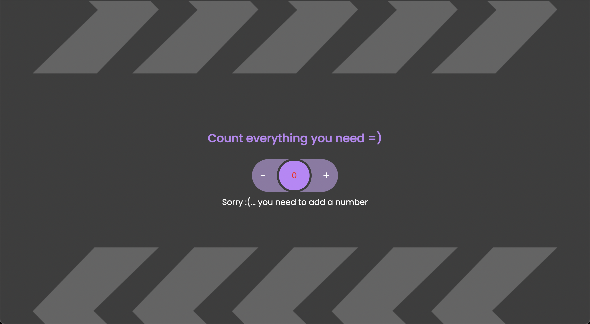

# counter JS

> ## **Description**

• create an application where the user can increase or decrease  
the value displayed on the web page initialized with the value 0. 
• DOM manipulation through js code to create html tags.

> ### **Project**

> [!NOTE]
> created with:

- [x] HTML
- [x] javascript
- [x] css
- [x] file audio
- [x] img

> [!IMPORTANT]
**Link to github file javascript in description:** 
[javascript](https://github.com/AleShini92/counter/blob/main/assets/js/counter.js)

> #### **Project color**

`#3c3c3c`   • DarkGray 
`#ffadef`   • Pink  
`#ea03f1`   • DarkPink

> ## **Link Project online**

[Link](https://jscounternumber.netlify.app/)